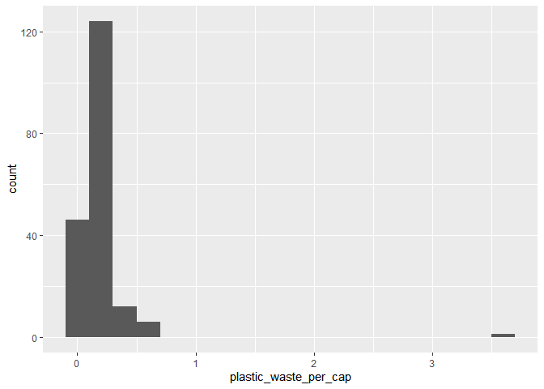
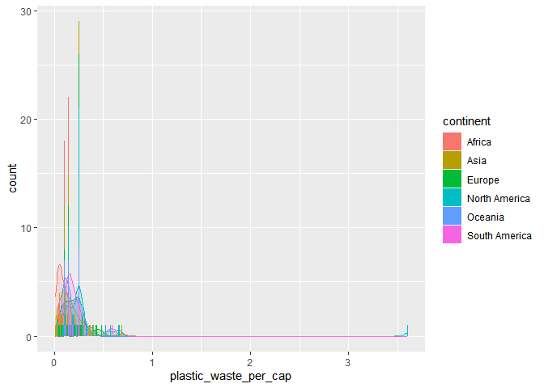
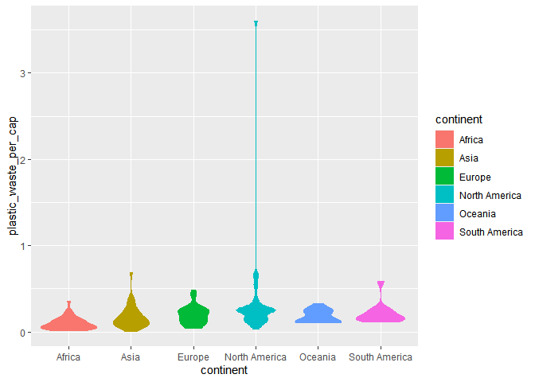
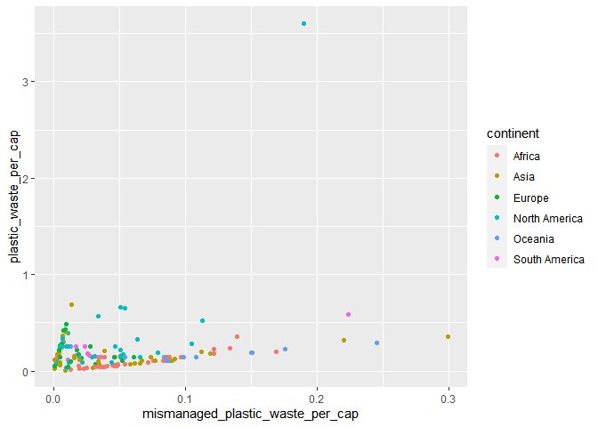
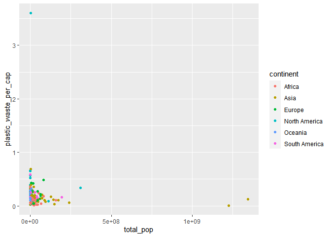
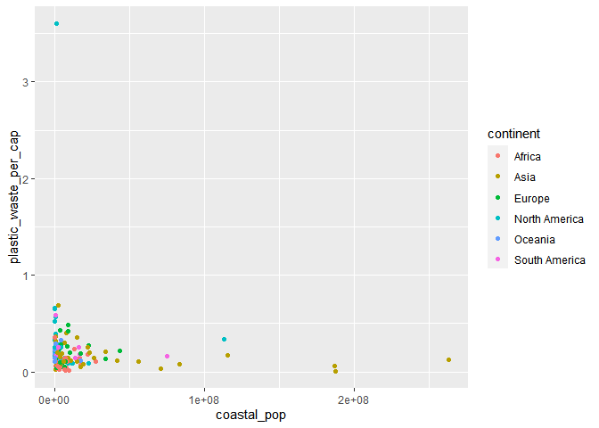
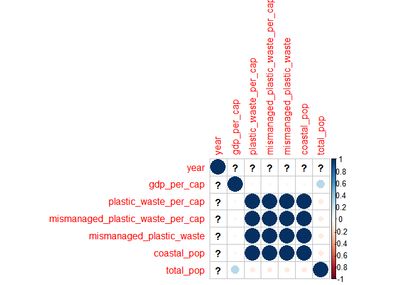

Lab 02 - Plastic waste
================
Mason
03/5/2023

## Load packages and data

``` r
library(tidyverse) 
```

``` r
plastic_waste <- read.csv("data/plastic-waste.csv")
```

## Exercises

### Exercise 1

Remove this text, and add your answer for Exercise 1 here.

``` r
ggplot(data = plastic_waste, aes(x = plastic_waste_per_cap)) +
  geom_histogram(binwidth = 0.2)
```

    ## Warning: Removed 51 rows containing non-finite values (`stat_bin()`).

<!-- -->

``` r
plastic_waste %>%
  filter(plastic_waste_per_cap > 3.5)
```

    ##   code              entity     continent year gdp_per_cap plastic_waste_per_cap
    ## 1  TTO Trinidad and Tobago North America 2010    31260.91                   3.6
    ##   mismanaged_plastic_waste_per_cap mismanaged_plastic_waste coastal_pop
    ## 1                             0.19                    94066     1358433
    ##   total_pop
    ## 1   1341465

### Exercise 2

``` r
ggplot(data = plastic_waste, 
       mapping = aes(x = plastic_waste_per_cap, 
                     color = continent, 
                     fill = continent)) +
  geom_density(alpha = 0.17)+
  geom_bar()
```

    ## Warning: Removed 51 rows containing non-finite values (`stat_density()`).

    ## Warning: Removed 51 rows containing non-finite values (`stat_count()`).

<!-- -->

### Exercise 3

``` r
ggplot(data = plastic_waste, 
       mapping = aes(x = continent, 
                     y = plastic_waste_per_cap,
                     color = continent, 
                     fill = continent)) +
  geom_violin()
```

    ## Warning: Removed 51 rows containing non-finite values (`stat_ydensity()`).

<!-- -->

### Exercise 4

Remove this text, and add your answer for Exercise 4 here.

``` r
ggplot(data = plastic_waste, 
       mapping = aes(x = mismanaged_plastic_waste_per_cap, 
                     y = plastic_waste_per_cap,
                     color = continent, 
                     fill = continent)) +
  geom_point()
```

    ## Warning: Removed 51 rows containing missing values (`geom_point()`).

<!-- -->

### Exercise 5

> Visualize the relationship between plastic waste per capita and total
> population as well as plastic waste per capita and coastal population.
> You will need to make two separate plots. Do either of these pairs of
> variables appear to be more strongly linearly associated?

``` r
ggplot(data = plastic_waste, 
       mapping = aes(x = total_pop, 
                     y = plastic_waste_per_cap,
                     color = continent, 
                     fill = continent)) +
  geom_point()
```

    ## Warning: Removed 61 rows containing missing values (`geom_point()`).

<!-- -->

``` r
ggplot(data = plastic_waste, 
       mapping = aes(x = coastal_pop, 
                     y = plastic_waste_per_cap,
                     color = continent, 
                     fill = continent)) +
  geom_point()
```

    ## Warning: Removed 51 rows containing missing values (`geom_point()`).

<!-- -->

``` r
plastic_waste %>% select(-c(code,entity,continent))%>%is.na()%>%cor()%>%
corrplot::corrplot()
```

    ## Warning in cor(.): the standard deviation is zero

<!-- -->

### Exercise 6

Remove this text, and add your answer for Exercise 6 here.

``` r
# insert code here
```

### Exercise 7

Remove this text, and add your answer for Exercise 7 here.

``` r
# insert code here
```

``` r
# insert code here
```

### Exercise 8

Remove this text, and add your answer for Exercise 8 here.

``` r
# insert code here
```
